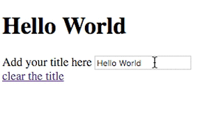

## Task

Imagine that you have to build a framework. Please implement the following features:

* templating
* event handling

Please develop the features as separate modules (parts) of the framework and write functional tests for them. Feel free to use your favorite testing framework. Just let us know how to run the tests. For templating [you can borrow existing ideas](http://ejohn.org/blog/javascript-micro-templating), but for the the main framework itself, you are not allowed to use any third party libraries or frameworks like jQuery, lodash or underscore.

The final result should look like this gif:



## The base

Here is the HTML file that you will start from:

```html
<!DOCTYPE html>
<html>
  <head>
    <script src="Framework.js"></script>
  </head>
  <body>

    <div class="content"></div>

    <script type="template/framework" id="header-template">
      <header>
        <h1>{{title}}</h1>
        <form>
          <label for="title">Add your title here</label>
          <input type="text" id="title" data-event="keyup:titleChanged" value="{{title}}" />
        </form>
        <a href="#" data-event="click:clearTitle">clear the title</a>
      </header>
    </script>

    <script>
      
      var header = Framework.create({
        template: '#header-template',
        data: {
          title: 'Hello World'
        },
        clearTitle: function(e) {
          document.querySelector('input').value = '';
          document.querySelector('h1').innerHTML = '';
        },
        titleChanged: function(e) {
          document.querySelector('h1').innerHTML = e.target.value;
        }
      });
      header.render('.content');

    </script>
  </body>
</html>
```

Please do not change the content of `index.html` (the base). The idea is for you to fill the content of `Framework.js` (currently an empty file) and make the things work without touching the code in the script tags.

### Templating

The HTML template is placed in a script tag. You should fetch the markup from there based on the `id`. Your framework has only one public method called `create`. It should accept an object literal with the following characteristics:

* `data` - all the properties of this object may be used in the template in the format of `{{property name}}`. Don't worry about nested objects
* custom functions - functions that will be called in a response of DOM events

### Event handling

The events that we are interested in should be described in `data-event` attributes. The format is `eventname:customfunction`. 

## Submission

Include a file named README.txt|md in your source code containing notes on design choices you made in solving the problem, and what you might have done to improve the program for real-world use given more time.

When you have completed the assessment, please package all source code into one folder and create a zip archive of this folder (e.g. test.zip) and submit this file as an email attachment.


## Notes

* This exercise should not take more than a couple of evenings. Please don't spend too long on it. Tell us how long you spent, and if you run out of time then please send notes on what you would have done given more time
* Don't worry too much about edge cases. We want to see how you think, how you construct your JavaScript applications. If your demo behaves like on the animated gif above we are happy.
* Don't worry about browser specific issues. Make sure that your demo works in latest Chrome.

